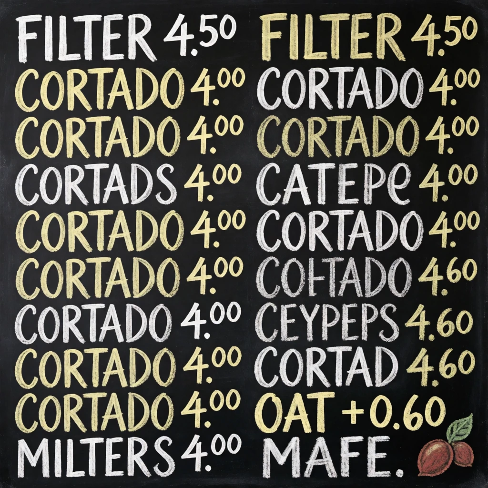
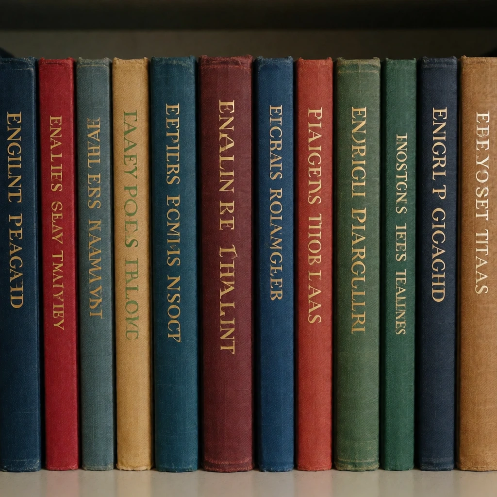
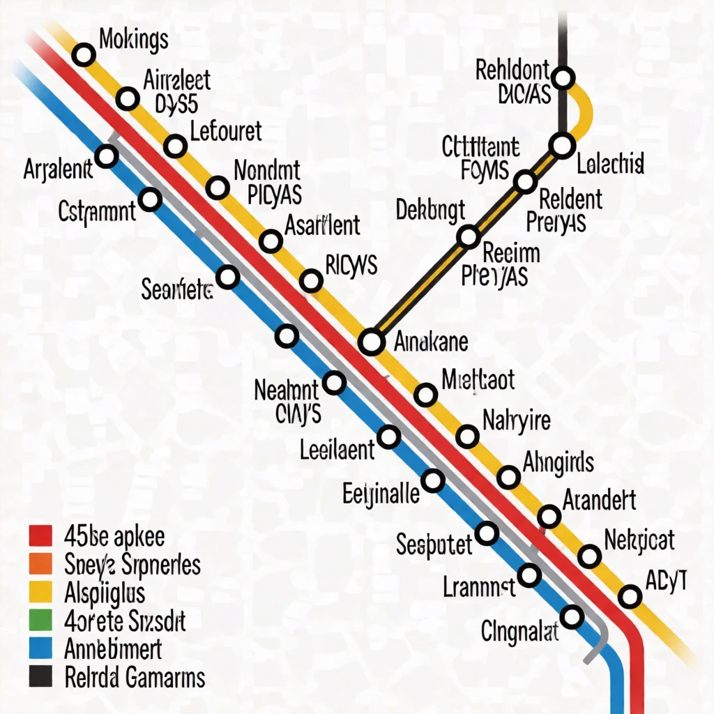
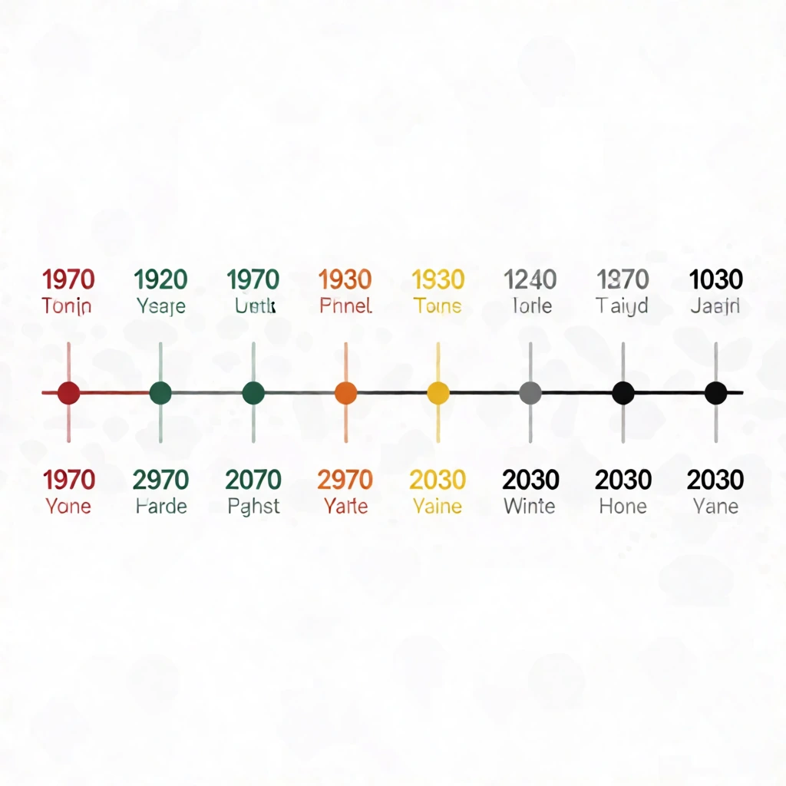
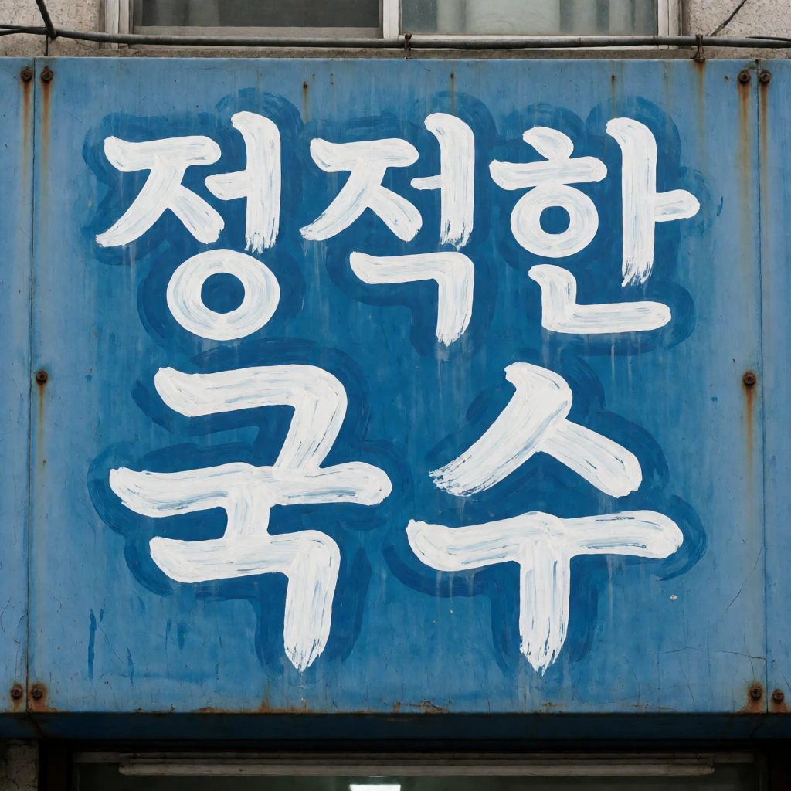
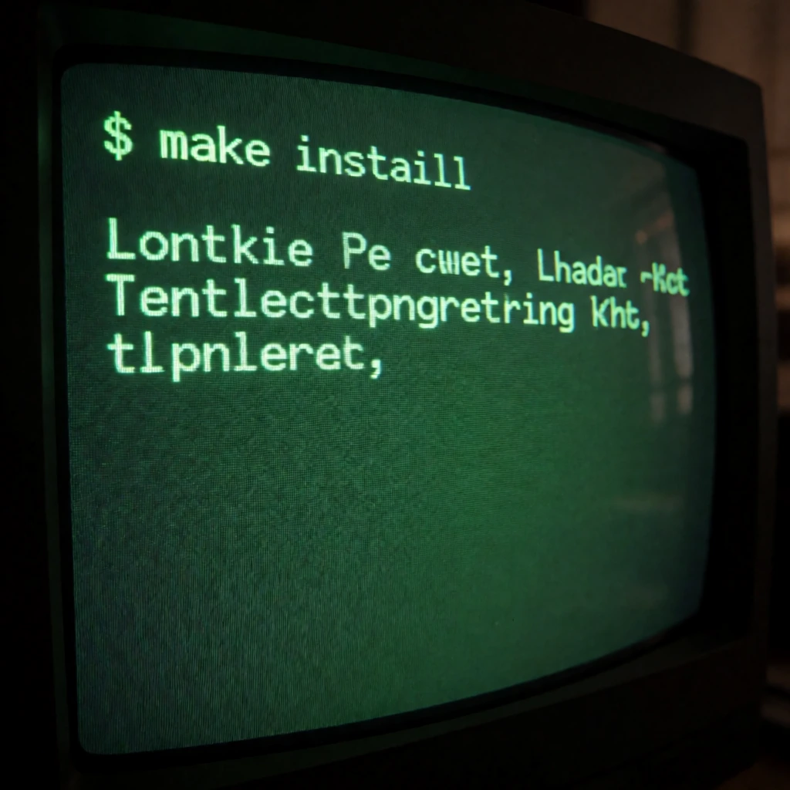
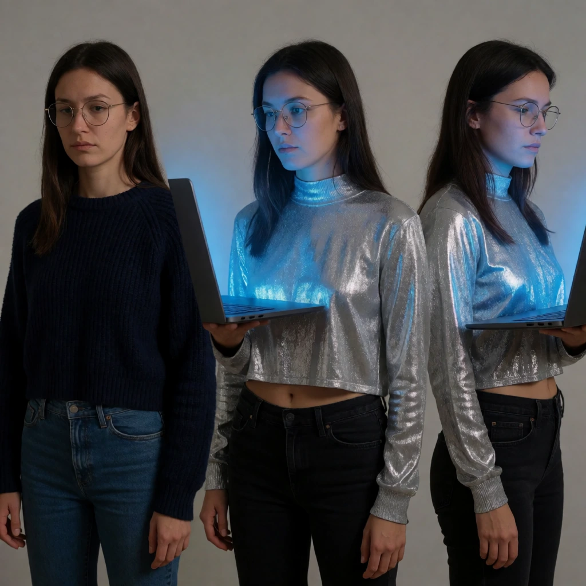

<h1 align="center">awesome-krea-2</h1>
<p align="center">85 reproducible prompts for Krea 2 Turbo, across 7 categories. Every prompt is copy-pasteable and every image is the actual output.</p>

<p align="center">
  
</p>

<p align="center">[ZH](README_ZH.md) · [KO](README_KO.md)</p>

## What this model actually does

Everything below was measured while building this catalog, not quoted from the model card. 114 generations went in, 85 are here, 29 were cut. Each claim names the entries that demonstrate it, and every entry carries the seed that produced it, so you can check any of this against the images in this repo.

### Text survives one sign and dies on a list

I went in expecting a word-count ceiling and my own results kill that theory. `HOLLOW & SON — MILLWRIGHTS — EST 1908` came back letter-perfect at eight words (**typography-008**). So did `PLATFORM 4`, `FRAGILE` + `THIS WAY UP`, `SOURDOUGH` + `£4.20`, `SEOUL` + `GATE 12`, `EST 1884`, `FRESH EGGS`. All 15 typography entries kept the string I asked for, and several of them carry two separate strings.

What breaks is not length, it is **how many independent text elements share the frame, and whether any of them is prose**. A chalkboard menu got `FILTER 4.50` and `CORTADO 4.00` right, then produced `CAPEME`, `CABIELO`, `PANSRUR` for the remaining rows. A shelf of twelve book spines, a transit map of thirty station names and an eight-point timeline were unreadable end to end. A safety sign rendered `DANGER` and `ARC FLASH AND SHOCK HAZARD` correctly and filled the paragraph beneath them with letter-shaped noise.

Korean fails earlier and more quietly. I asked for 정직한 국수 and got 정적한 — one character wrong in a four-syllable string. If you do not read Korean it looks clean; if you do, it is the first thing you see.

Practical rule: one sign, one label, one price tag, at any length. Not a menu, not a bibliography, not a sentence.

Those failures are not in this repo — they are part of the 29 that were cut.

### Character identity does not survive across generations

A reference sheet of a specific person renders well — see **reference-sheet-001**. Reusing that person in a new scene does not work, and image-to-image does not rescue it, because the two useful settings fail in opposite directions:

- `strength 0.72` — genuinely new scene, but a different person. Only the sweater and the palette carry over.
- `strength 0.45` — recognisably the same person, but the source composition comes with her. A three-view studio sheet became the same three views at a harbour.

There is no middle setting that gives the same face in a different photograph. If you need a consistent character, train a LoRA; prompting cannot do it. This is why there is no character-consistency category here.

### It changes medium willingly and scene content reluctantly

Image-to-image is reliable when you ask for a different *rendering* of the same scene. Rice terraces became a convincing gouache painting with the terrace contours intact (**editing-003**); a woodblock wave took a dusk palette while every keyblock outline stayed put (**editing-005**); an exploded camera diagram became a clean cyanotype blueprint with every component in place (**editing-008**).

It is unreliable when you ask it to add or remove *things*. Three attempts failed and were cut rather than shipped with captions that did not match the images: removing the steam from a mug returned the steam; adding snow and sea ice to a coastline returned the same coastline slightly cooler; darkening a sauna's window returned the window still lit.

`strength` between 0.50 and 0.60 preserved composition while allowing the medium to change. No value made object-level edits work.

## Check any of this yourself

Every entry carries the seed that produced it, so no claim here has to be taken on trust:

```bash
python3 scripts/regen.py --id typography-012
```

Regenerating two entries and comparing against the files in this repo gave a mean per-pixel difference of 1.3 and 1.5 out of 255, which is WebP re-encoding loss. The seed reproduces the generation; the repo stores the re-encode.

## The failures, kept as evidence

Deliberately reproduced failures. Every claim in the README's findings section points at one of these, with the seed that produced it, so the limits are checkable rather than asserted. These are NOT part of the 85-entry catalog.

| | What was asked for | What came back |
|---|---|---|
|  | Ten legible menu rows | Text: a list of many strings collapses after the first few <br>`seed: 1729505870` |
|  | Twelve readable invented titles | Text: twelve independent strings in one frame, all unreadable <br>`seed: 1095803014` |
|  | Legible station names | Text: thirty station names, none of them words <br>`seed: 57616412` |
|  | Eight year+label pairs | Text: years render, labels do not <br>`seed: 797625079` |
|  | 정직한 국수 | Text: Korean fails one character in, and looks clean if you cannot read it <br>`seed: 1910572019` |
|  | $ make install plus three lines of build output | Text: the command line renders, the output beneath it does not <br>`seed: 1530960951` |
|  | The woman from reference-sheet-001 | Identity: at strength 0.72 the scene is new and the person is not the same <br>`seed: 1317515569` |
|  | No steam | Editing: asked to remove the steam, returns the steam <br>`seed: 1499506316` |

## Categories

- [photography](#photography) — 18
- [typography](#typography) — 15
- [product](#product) — 18
- [illustration](#illustration) — 18
- [reference-sheet](#reference-sheet) — 1
- [isometric-3d](#isometric-3d) — 10
- [editing](#editing) — 5


## photography

_Photoreal scenes — lighting, lens behaviour, film stock_

### Ceramicist at golden hour, 85mm


**Prompt**

```text
A ceramicist in her studio at golden hour, hands wet with slip, throwing a bowl on a kick wheel. Shot on 85mm at f/1.8, shallow depth of field, warm rim light from a west-facing window, dust motes in the beam. Muted earth palette, visible clay dust on her forearms.
```

`seed: 1913817765`

### Rain-soaked crosswalk, neon reflections


**Prompt**

```text
A rain-soaked crosswalk at night in Seoul, seen from a low angle at pavement level. Neon signage reflected and broken across the wet asphalt, a single pedestrian mid-stride with an umbrella. 35mm, deep focus, high contrast, cyan and magenta cast against black.
```

`seed: 1037393037`

### Cold-lit surgical corridor


**Prompt**

```text
An empty hospital corridor lit only by overhead fluorescents, one tube flickering. Polished linoleum reflecting the ceiling lights into long streaks. Symmetrical one-point perspective, 24mm, slight barrel distortion, desaturated green-grey palette, absolutely no people.
```

`seed: 306108529`

### Portra 400 family kitchen


**Prompt**

```text
A cluttered family kitchen mid-morning, shot on Kodak Portra 400, slight grain and halation on the highlights. Steam from a kettle catching the window light, dishes stacked, a child's drawing taped to a cabinet. Natural skin tones, soft contrast, 50mm.
```

`seed: 1671971794`

### Macro: solder joint


**Prompt**

```text
Extreme macro of a hand-soldered joint on a green PCB, 5:1 magnification, focus stacked so the entire solder fillet is sharp. Visible flux residue, the silkscreen label R14 legible beside it. Cold ring light, shallow background falloff into black.
```

`seed: 1136909792`

### Overcast coastline, long exposure


**Prompt**

```text
A basalt coastline under heavy overcast, 30-second long exposure so the surf becomes a low white mist around the rocks. Horizon dead level, no sun, 16mm, ND1000, cool grey palette with a single ochre patch of lichen in the foreground.
```

`seed: 589730875`

### Backlit dust in a warehouse


**Prompt**

```text
A disused warehouse interior, late afternoon sun entering through a high broken window as a hard visible shaft. Dust suspended in the beam, everything outside the beam falling to near-black. 35mm, heavy contrast, one strong light source only.
```

`seed: 1496444718`

### Flash-lit street portrait at night


**Prompt**

```text
A street portrait at night, direct on-camera flash, subject one metre from the lens, background falling off to black within two metres. Harsh specular highlights on skin, red-eye avoided, 28mm, the raw snapshot aesthetic of 1990s tabloid photography.
```

`seed: 1204392285`

### Aerial: terraced rice fields


**Prompt**

```text
Directly overhead drone shot of terraced rice fields at flooding stage, water surfaces mirroring a pale sky so the terraces read as abstract silver contours. No horizon. Late afternoon, long shadows from the retaining walls, subtle green fringe of new growth.
```

`seed: 1726756617`

### Tungsten-lit diner booth


**Prompt**

```text
A booth in an empty roadside diner at 2am, lit by warm tungsten pendants against cold blue exterior night through the window. Chrome napkin dispenser catching both colour temperatures. 40mm, slight vignette, colour contrast between the two light sources is the subject.
```

`seed: 1590663786`

### Fog bank on a suspension bridge


**Prompt**

```text
The upper cables of a suspension bridge disappearing into a fog bank, shot from the deck with a 200mm lens so the towers compress into flat silhouetted layers. Visibility drops to nothing by the second tower. Cool grey monochrome broken only by one amber sodium lamp.
```

`seed: 1647355798`

### Window seat, altitude


**Prompt**

```text
From an aircraft window at cruising altitude: the wing's trailing edge in the lower third, a solid deck of cloud below, and the curvature of the horizon under a gradient from pale gold to deep indigo. Slight scratches and haze in the acrylic pane, deliberately not corrected.
```

`seed: 849986701`

### Sauna interior, steam


**Prompt**

```text
A cedar sauna interior lit by one small high window, steam rolling off the stove rocks and catching the light. Wet benches, condensation running down the wall boards. 24mm, warm brown palette, the air itself is the subject.
```

`seed: 1447903387`

### Night market, tungsten and smoke


**Prompt**

```text
A night market food stall shot from across the aisle, tungsten bulbs overhead, smoke from a griddle drifting through the light. Vendor mid-motion so the hands blur while the stall stays sharp. 35mm, 1/15s, handheld.
```

`seed: 860958653`

### Frost on single-glazed glass


**Prompt**

```text
Macro of frost crystals on the inside of a single-glazed window at dawn, backlit by low sun so each dendrite glows. Focus falls off within a centimetre. Blue shadow tones against a warm bloom, no other subject.
```

`seed: 1223022199`

### Empty swimming pool, drained


**Prompt**

```text
A drained municipal swimming pool photographed from the deep end floor looking up at the diving board. Cracked blue paint, leaf litter in the corners, harsh midday sun cutting a hard diagonal across the tiled wall. 20mm, exaggerated verticals.
```

`seed: 1658386034`

### Workshop hands, no face


**Prompt**

```text
Close crop of a woodworker's hands setting a hand plane on a bench, wrist and forearm only, no face in frame. Shavings curling from the mouth of the plane. Soft north light, 60mm macro, shallow focus on the blade edge.
```

`seed: 1007639879`

### Motorway at dusk, long lens


**Prompt**

```text
A motorway interchange shot from an overpass with a 400mm lens at dusk, headlight and taillight streams compressed into stacked ribbons of white and red. Traffic and infrastructure become pure horizontal bands. 8-second exposure, no sky visible.
```

`seed: 1873728665`


## typography

_Short-string text rendering. Krea 2 holds a single sign or label at any length, including an eight-word plaque, but degrades once several independent strings or a paragraph share the frame._

### Enamel pin packaging


**Prompt**

```text
Retail backing card for an enamel pin, photographed flat. The card reads "NIGHT SHIFT" in a condensed grotesque at the top and "limited to 200" in small caps at the bottom. Riso-style two-colour print, fluorescent orange and navy, visible paper tooth and slight misregistration.
```

`seed: 333206637`

### Letterpress business card, macro


**Prompt**

```text
Macro of a letterpress business card on cotton stock, raking light from the left so the deep impression casts visible shadows in the counters. The card reads "HOLLOW & SON — MILLWRIGHTS — EST 1908" in a small caps serif. Single ink colour, deep indigo, generous letterspacing.
```

`seed: 1431711597`

### Stencilled crate marking


**Prompt**

```text
A wooden shipping crate photographed straight on, stencilled in black spray paint with exactly "FRAGILE" above "THIS WAY UP". Paint has bled slightly through the stencil edges. Weathered pine, raking side light.
```

`seed: 1101869585`

### Enamel station sign


**Prompt**

```text
A vitreous enamel railway platform sign on a brick wall, dark blue ground with white letters reading exactly "PLATFORM 4". Chipped at one corner exposing the steel. Straight-on, overcast light.
```

`seed: 1556240670`

### Embroidered cap


**Prompt**

```text
Macro of a canvas cap's front panel with "NORTH YARD" embroidered in cream chain-stitch on olive twill. Visible thread texture and slight puckering of the fabric under the stitching.
```

`seed: 1864240842`

### Neon, one word


**Prompt**

```text
A single neon sign on a brick wall at dusk reading exactly "OPEN" in cursive rose-pink tube, visible glass path and mounting standoffs, pink spill on the brick. One segment dark.
```

`seed: 235613196`

### Hot-foil business card


**Prompt**

```text
Macro of a black cotton business card with "MERIDIAN" hot-foil stamped in copper, raking light catching the foil. No other text. Shallow depth of field.
```

`seed: 2040305462`

### Chalk price tag


**Prompt**

```text
A small slate price tag propped in a bakery basket, hand-chalked with exactly "SOURDOUGH" and "£4.20" beneath it. Warm morning light, shallow focus, flour dust on the slate.
```

`seed: 1659883`

### Painted boat transom


**Prompt**

```text
The transom of a wooden fishing boat, hand-painted in white serif capitals reading exactly "MARY ANNE". Green hull, salt-weathered paint, waterline just visible. Straight-on documentary framing.
```

`seed: 375084430`

### Letterpress poster, two words


**Prompt**

```text
A letterpress poster on cotton paper reading exactly "KEEP GOING" in wood type, deep impression visible under raking light, single ink colour oxblood, generous margins, no other elements.
```

`seed: 833951684`

### Machine-shop door


**Prompt**

```text
A steel workshop door with an aluminium plate riveted at eye level, engraved "TOOL ROOM" in machine-cut capitals filled with black paint. Scuffed metal, industrial lighting.
```

`seed: 984217211`

### Airport gate display


**Prompt**

```text
A split-flap departure board close-up showing a single row reading exactly "SEOUL" and "GATE 12". Mechanical flaps mid-settle on one character. Warm indicator lighting, shallow depth.
```

`seed: 1590119155`

### Fire door sign


**Prompt**

```text
A steel fire door with a rectangular sign at eye level reading exactly "FIRE EXIT" in white on green, small running-figure pictogram beside the text. Scuffed paint, institutional corridor lighting, straight-on.
```

`seed: 2060170403`

### Engraved brass plaque


**Prompt**

```text
A small brass plaque screwed to a stone wall, engraved and blacked with exactly "EST 1884". Patina in the letter recesses, raking afternoon light, shallow depth of field.
```

`seed: 425919870`

### Tin sign, two words


**Prompt**

```text
A weathered enamel tin sign nailed to a barn wall reading exactly "FRESH EGGS" in hand-painted red capitals on cream. Rust bleeding from two nail heads, overcast light, straight-on documentary framing.
```

`seed: 722835994`


## product

_Product and packaging shots, studio and in-context_

### Perfume bottle, hard light


**Prompt**

```text
A faceted glass perfume bottle on a polished black surface, single hard key light from upper left creating one crisp specular edge down the bottle's spine and a sharp reflection beneath. Deep shadow elsewhere. No label. Product photography, 100mm macro, f/11.
```

`seed: 524883984`

### Coffee bag, in-context


**Prompt**

```text
A kraft coffee bag with a matte white label standing on a scratched steel countertop in a working roastery, bokeh of roasting drums behind. Natural window light from camera left. The bag looks used, one corner folded and clipped. Editorial rather than studio.
```

`seed: 98544605`

### Mechanical keyboard, top-down


**Prompt**

```text
Top-down flat lay of an aluminium 65% mechanical keyboard on a grey desk mat, keycaps in beige and slate with one red escape key. Even diffuse light, no hotspots, every legend crisp and readable. Coiled aviator cable arranged in a loose S to the upper right.
```

`seed: 1919442279`

### Skincare on wet stone


**Prompt**

```text
A frosted glass dropper bottle resting on a wet slate slab, water beading and running off the edge. Cool north light, soft gradient background from pale grey to white. A single eucalyptus leaf, slightly out of focus, in the lower right. Clean, cold, clinical.
```

`seed: 2048927115`

### Sneaker, floating explode


**Prompt**

```text
A running shoe photographed against seamless light grey with its components separated and suspended in an exploded view — outsole, midsole, upper, laces, insole — each layer held apart with even spacing. Soft top light, consistent shadows implying a single source, technical and legible.
```

`seed: 700222067`

### Watch macro, brushed steel


**Prompt**

```text
Macro of a brushed steel dive watch bezel and crown, focus stacked so the knurling on the crown and the brushing grain on the case are both sharp. Controlled reflection strip along the polished chamfer. Dark grey background, no logo visible.
```

`seed: 1367506460`

### Cast iron pan, overhead with food


**Prompt**

```text
Overhead of a seasoned cast iron skillet on a scorched linen cloth, containing a half-eaten galette with visible flaking layers. Crumbs on the cloth. Directional afternoon light from the top of frame with real falloff toward the bottom. Nothing styled to perfection.
```

`seed: 2127336597`

### Cable and connector detail


**Prompt**

```text
A braided USB-C cable coiled loosely on a white acrylic surface, one connector standing upright and in focus showing the moulded strain relief and contacts. Bright even light, faint shadow, the coil falling out of focus behind. Catalogue clarity.
```

`seed: 2081046429`

### Ceramic mug, steam


**Prompt**

```text
A speckled stoneware mug of black coffee on a pale oak table, backlit so the rising steam is clearly visible against a dark background. Reactive glaze pooling at the base. The steam is the hero — it must read as real vapour, not smoke.
```

`seed: 130047460`

### Packaging flat lay, unboxed


**Prompt**

```text
An unboxed product flat lay: rigid box lid to the left, tissue paper unfolded, a small booklet, and the product itself centre right. Shot from directly overhead on a warm grey backdrop, soft shadowless light, elements aligned to an invisible grid with generous negative space.
```

`seed: 1260154266`

### Vinyl record and sleeve


**Prompt**

```text
A vinyl record half-withdrawn from its sleeve on a walnut surface, raking light picking out the groove texture and one fingerprint on the run-out. Sleeve plain matte black, no artwork. 50mm, single softbox from the left, deep falloff to the right.
```

`seed: 1427728813`

### Fountain pen nib, extreme macro


**Prompt**

```text
Extreme macro of a fountain pen nib, focus stacked so the tipping material, the slit and the breather hole are all sharp. Ink residue in the feed channels. Dark field lighting so the steel reads as bright edges against black.
```

`seed: 2063722228`

### Climbing shoe, worn


**Prompt**

```text
A single well-worn climbing shoe on raw concrete, rubber scuffed through at the toe, laces frayed. Hard overhead light casting a tight shadow. Nothing styled — the wear is the subject. 85mm, f/8.
```

`seed: 1309089861`

### Glassware set, backlit


**Prompt**

```text
Three drinking glasses of graduated height on a white acrylic surface, backlit so the walls read as bright rims and the bases as dense caustics. No labels, no reflections of the studio. Perfectly level camera, clinical.
```

`seed: 329967531`

### Leather satchel, texture


**Prompt**

```text
A tan leather satchel on a linen backdrop, side-lit to bring out the grain, stitch holes and the darkening around the buckle where it is handled. Slight sag in the flap from real use. 90mm macro, f/5.6.
```

`seed: 2115381394`

### Espresso tamper on grounds


**Prompt**

```text
A stainless espresso tamper resting on a bed of fresh grounds in a portafilter, top-down, single hard light from the upper right. Grounds crisp enough to read individual particles at the edge of the puck.
```

`seed: 987689524`

### Wool swatch stack


**Prompt**

```text
A stack of eight folded wool fabric swatches in muted heather tones, shot from a low three-quarter angle so the stack reads as bands of colour and texture. Soft even light, no shadow drama, catalogue clarity.
```

`seed: 1858895601`

### Bike drivetrain, dirty


**Prompt**

```text
A road bike's rear cassette and derailleur photographed side-on, chain grimy with real road dirt, one cog catching a highlight. Garage light, unglamorous, mechanical honesty. 100mm macro, f/6.3.
```

`seed: 1450341996`


## illustration

_Stylised, painterly, editorial_

### Editorial: burnout


**Prompt**

```text
An editorial illustration for an article on developer burnout. A figure at a desk rendered as a slowly unravelling ball of yarn, the loose thread running off the desk and out of frame. Limited palette: ink black, bone white, one dusty coral. Textured screenprint grain, generous negative space.
```

`seed: 1809538529`

### Gouache mountain hut


**Prompt**

```text
A small stone hut on an alpine ridge at dusk, painted in gouache with visible brush texture and slightly chalky opacity. Cool blue snow shadows against a warm ochre sky. Simplified shapes, no outlines, hard edges where the paint has dried in layers.
```

`seed: 989989533`

### Ligne claire street scene


**Prompt**

```text
A European city street in ligne claire style — uniform black contour lines of even weight, flat unmodulated colour fills, no hatching or gradients. A cyclist passing a bakery, a cat on a windowsill. Clear midday light implied purely through colour choice, not shading.
```

`seed: 193829588`

### Woodblock wave study


**Prompt**

```text
A single breaking wave in the manner of a Japanese woodblock print: flat colour fields, keyblock outlines, visible wood grain texture in the sky area, deliberate slight misregistration of the blue plate. Indigo, pale sand, off-white paper tone. No figures.
```

`seed: 2141994631`

### Technical cutaway, hand-drawn


**Prompt**

```text
A hand-drawn technical cutaway of a mechanical wristwatch movement, ink line with light watercolour wash, leader lines pointing to unlabelled callout circles. Slightly imperfect linework showing it was drawn by hand. Warm paper tone, sepia ink.
```

`seed: 711741992`

### Risograph two-colour poster


**Prompt**

```text
A two-colour risograph poster of a lone figure walking a dog across a wide empty field. Fluorescent pink and teal only, overprint where they cross producing a muddy third tone. Visible paper grain, roller streaks, 2mm misregistration on the teal layer.
```

`seed: 1958333047`

### Children's book interior


**Prompt**

```text
An interior spread from a children's picture book: a badger in a knitted scarf reading by lamplight in a burrow, roots visible through the earth walls. Soft coloured pencil texture, warm palette, no harsh outlines, plenty of quiet space in the composition.
```

`seed: 437733224`

### Brutalist architecture, ink


**Prompt**

```text
An ink drawing of a brutalist concrete community centre, cross-hatched shading only, no grey wash. Heavy contrast between lit and shadowed planes achieved entirely through hatch density. Slight wobble in the straight lines betraying a human hand.
```

`seed: 1322534157`

### Botanical plate


**Prompt**

```text
A scientific botanical plate of a fig branch: full branch centre, with a dissected fruit cross-section and a single leaf detail arranged around it. Fine stippled shading, muted natural colour, aged cream paper, small unobtrusive numbered labels.
```

`seed: 1395552785`

### Noir spot illustration


**Prompt**

```text
A small spot illustration in high-contrast black and white: a hand pushing open a frosted glass office door, silhouetted venetian blind shadows falling across it. Pure black and pure white only, no midtones, shapes reading instantly at thumbnail size.
```

`seed: 662846866`

### Editorial: the commute


**Prompt**

```text
An editorial illustration about commuting: a figure rendered as a folded paper boat drifting down a river of grey office windows. Two colours plus black, screenprint grain, large areas of untouched paper.
```

`seed: 971992746`

### Cyanotype fern


**Prompt**

```text
A single fern frond in the manner of a cyanotype photogram — Prussian blue ground, the frond rendered as a soft white silhouette with slight halation at the edges. Uneven wash and paper texture visible.
```

`seed: 403745806`

### Scratchboard owl


**Prompt**

```text
A barn owl rendered in scratchboard: white lines carved from solid black, feather detail built entirely from directional scratches of varying density. No grey, no colour, high drama.
```

`seed: 94561777`

### Isotype-style pictogram set


**Prompt**

```text
A set of nine pictograms in the Isotype tradition arranged in a grid: figures, vehicles and buildings reduced to flat black silhouettes with uniform stroke logic. No outlines, no detail, instantly legible at any size.
```

`seed: 1365362645`

### Watercolour harbour, wet-in-wet


**Prompt**

```text
A small harbour at low tide painted wet-in-wet so the sky and water bleed into each other with hard drying edges where the paint pooled. Boats reduced to a few loaded brushstrokes. Muted ochre and slate.
```

`seed: 1827344974`

### Comic panel, chiaroscuro


**Prompt**

```text
A single comic panel: a figure descending a stairwell lit by one bare bulb, drawn in heavy brush-and-ink chiaroscuro with large solid blacks and minimal hatching. No panel border, no text.
```

`seed: 235666898`

### Mid-century travel poster


**Prompt**

```text
A mid-century travel poster for a fictional coastal town: flat colour blocks, simplified geometry, a lighthouse and cliff reduced to three shapes, screenprint texture and one warm accent against cool tones. No text.
```

`seed: 1377917160`

### Anatomical study, red chalk


**Prompt**

```text
An anatomical study of a human hand in red chalk on toned paper, in the manner of a Renaissance sketchbook — construction lines left visible, several overlapping attempts at the thumb on the same sheet.
```

`seed: 221852696`


## reference-sheet

_Character reference sheets and turnarounds_

### Reference sheet — establishing


**Prompt**

```text
Character reference sheet for a woman in her sixties: silver hair cut short, a small crescent scar above the right eyebrow, wire-frame glasses, a heavy navy fisherman's sweater. Three views on one sheet — front, three-quarter, profile — consistent proportions, neutral grey background, even light.
```

`seed: 1453254312`

> Generate this first and use it as the reference for character-002 through 005.


## isometric-3d

_Isometric scenes, dioramas, game-ready assets_

### Isometric repair shop


**Prompt**

```text
A small isometric diorama of a bicycle repair shop with the front wall removed: workbench, wheel truing stand, parts bins, a bike upside down on a stand. True isometric projection with no perspective convergence, soft clay-render materials, single warm key light from upper left, floating on a plain background.
```

`seed: 1886079203`

### Isometric server room


**Prompt**

```text
Isometric cutaway of a small server room: two racks with visible cable management, an overhead cable tray, a floor-standing UPS, and a portable AC unit. Cool blue LED accents against neutral grey hardware. Clean edges, ambient occlusion in the corners, no text on the equipment.
```

`seed: 1075533955`

### Game asset — modular tiles


**Prompt**

```text
A sheet of six modular isometric floor and wall tiles for a game: stone floor, cracked stone floor, wooden floor, plain wall, wall with a doorway, wall with a barred window. Consistent lighting angle and tile dimensions across all six so they tessellate. Flat background, evenly spaced grid.
```

`seed: 1357449396`

### Low-poly island


**Prompt**

```text
A low-poly floating island: faceted terrain with visible flat triangles, a single stylised pine, a waterfall spilling from the underside into nothing. Hard-edged shading with no smoothing, saturated but limited palette, three-quarter isometric view against a pale gradient.
```

`seed: 1882712822`

### Exploded isometric — camera


**Prompt**

```text
An exploded isometric view of a 35mm film camera, components separated vertically along a single axis: body, lens elements, shutter assembly, film back, winding mechanism. Consistent spacing, thin grey guide lines connecting the parts, matte technical rendering.
```

`seed: 1583709833`

### Isometric coffee bar


**Prompt**

```text
An isometric cutaway of a small coffee bar: espresso machine, grinder, pastry case, two stools and a back shelf of cups. True isometric with no perspective convergence, soft clay materials, single warm key from upper left, floating on a plain ground.
```

`seed: 882577384`

### Isometric printing workshop


**Prompt**

```text
Isometric diorama of a letterpress workshop with the front wall removed: a platen press, type cases, an inking slab and drying racks with sheets hanging. Consistent 30-degree axes, matte materials, ambient occlusion in the corners.
```

`seed: 1975246446`

### Low-poly desert canyon


**Prompt**

```text
A low-poly desert canyon section: faceted rock strata in graduated ochre bands, a dry riverbed, two stylised saguaro. Hard-edged flat shading with no smoothing, three-quarter isometric against a pale gradient.
```

`seed: 1391597167`

### Exploded isometric — bicycle hub


**Prompt**

```text
An exploded isometric view of a bicycle rear hub, components separated along the axle: axle, bearings, freehub body, cassette spacer, end caps. Even spacing, thin grey guide lines, matte technical rendering, no text.
```

`seed: 226111579`

### Isometric rooftop garden


**Prompt**

```text
Isometric rooftop garden: raised beds, a small greenhouse, water butt, folding chairs and a ventilation stack. Plants stylised as simple massed forms. Soft top light, gentle shadows, floating on a plain background.
```

`seed: 1496030377`


## editing

_Image-to-image edits whose source is another entry in this catalog_

### Relight this coastline


**Prompt**

```text
Relight this coastline: replace the flat overcast with hard low-angle late afternoon sun from frame right, casting long shadows across the basalt. Keep the rock placement, horizon line and framing identical.
```

_Image-to-image from **Overcast coastline, long exposure** ([`photography-006`](#overcast-coastline-long-exposure)) in this repo · `strength: 0.55`_

`seed: 364022812`

> Source is photography-006 in this repo, so the edit is reproducible from a clone.

### Keep this corridor's geometry and perspective exactly. Chang


**Prompt**

```text
Keep this corridor's geometry and perspective exactly. Change only the time and mood: warm amber emergency lighting instead of cold fluorescents, one light source at the far end, everything nearer falling into shadow.
```

_Image-to-image from **Cold-lit surgical corridor** ([`photography-003`](#cold-lit-surgical-corridor)) in this repo · `strength: 0.5`_

`seed: 1459264371`

> Source is photography-003 in this repo, so the edit is reproducible from a clone.

### Re-render these terraced fields as a gouache painting with v


**Prompt**

```text
Re-render these terraced fields as a gouache painting with visible brush texture and chalky opacity. Every terrace contour stays in exactly the same position; only the medium changes.
```

_Image-to-image from **Aerial: terraced rice fields** ([`photography-009`](#aerial-terraced-rice-fields)) in this repo · `strength: 0.6`_

`seed: 583476278`

> Source is photography-009 in this repo, so the edit is reproducible from a clone.

### Recolour this woodblock wave to a dusk palette — deep violet


**Prompt**

```text
Recolour this woodblock wave to a dusk palette — deep violet water, salmon sky, warm cream foam. Keep every keyblock outline and flat colour field boundary exactly where it is.
```

_Image-to-image from **Woodblock wave study** ([`illustration-004`](#woodblock-wave-study)) in this repo · `strength: 0.55`_

`seed: 2083277726`

> Source is illustration-004 in this repo, so the edit is reproducible from a clone.

### Blueprint version of the exploded camera


**Prompt**

```text
Re-render this exploded camera diagram as a cyanotype blueprint: white line work on Prussian blue, every component in exactly the same position and spacing.
```

_Image-to-image from **Exploded isometric — camera** ([`isometric-3d-005`](#exploded-isometric--camera)) in this repo · `strength: 0.6`_

`seed: 1652457598`


## Contributing

Open a PR adding an entry to `prompts.json` plus your output image. Two rules: the prompt must reproduce, and the image must be the unedited output.

## License

Prompts are MIT — take them.

**The images are AI-generated.** They were produced with Krea 2 Turbo and are presented as model output, not as photographs or human artwork. Under the Krea 2 Community License you own outputs you generate yourself; commercial use is permitted below $1M annual company revenue, and the licence separately requires content filtering, which was left enabled for every image here. One entry was dropped after the safety checker flagged it.

Nothing here was retouched, upscaled or cropped. Every seed is recorded so you can regenerate the exact file.
