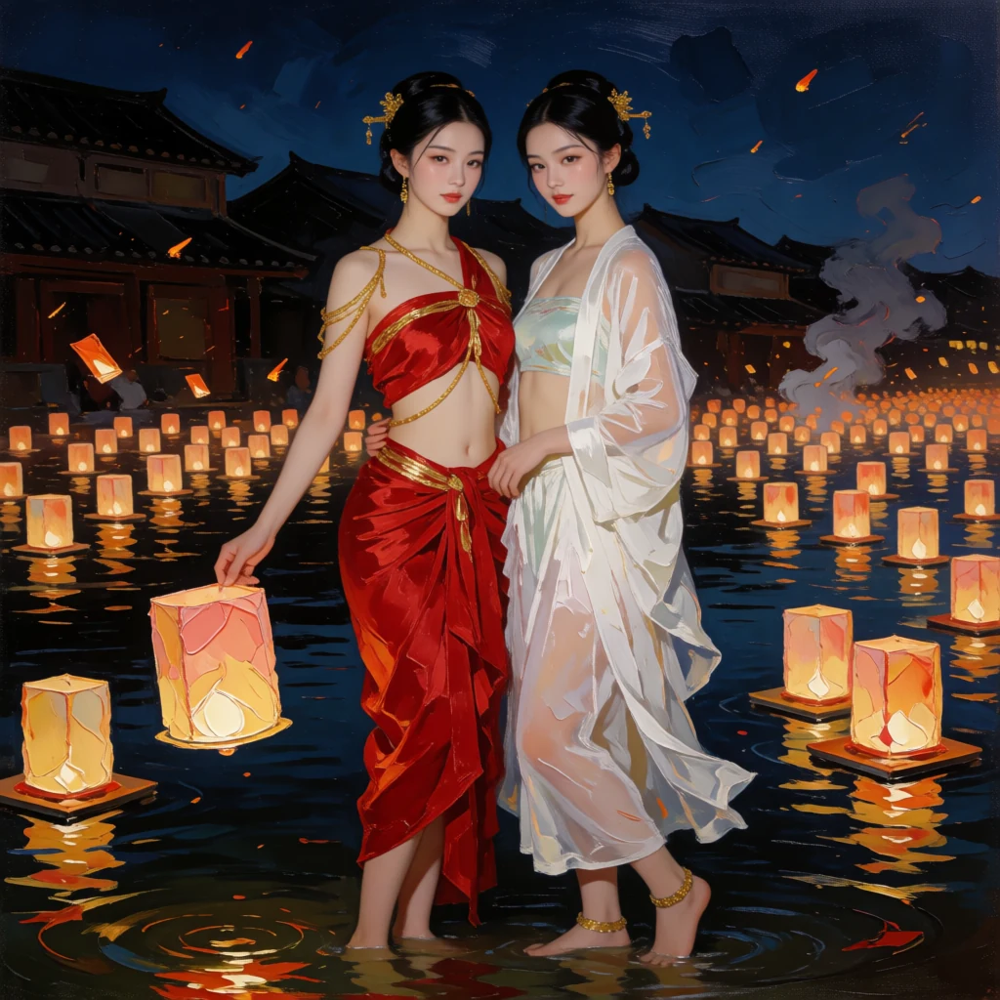
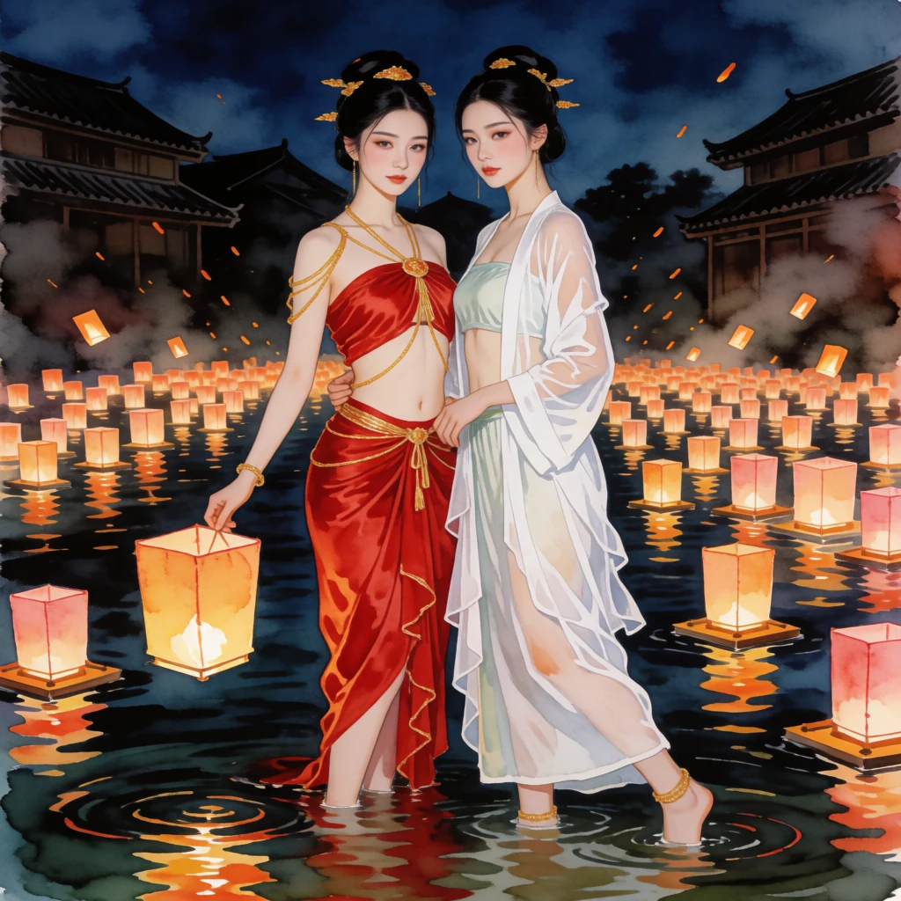
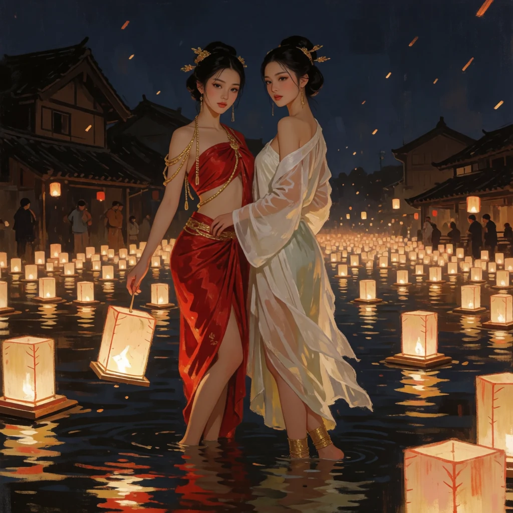
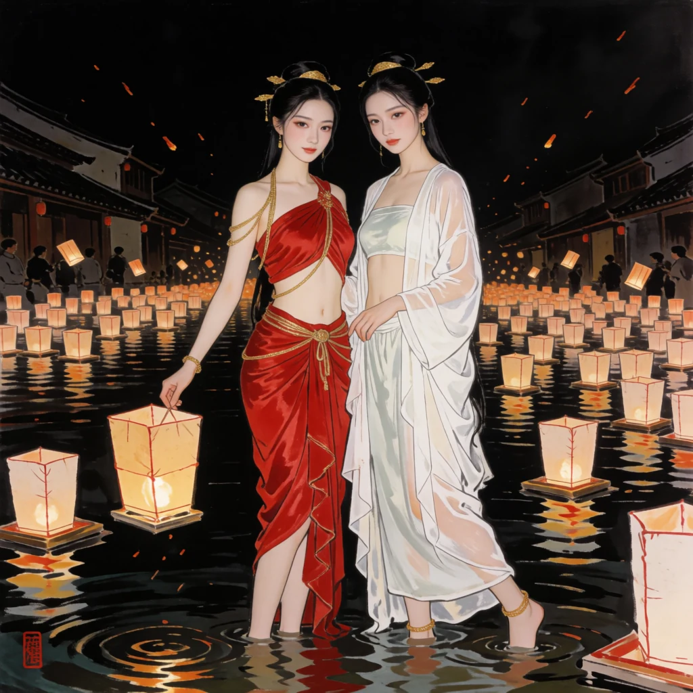

# Styles — one subject, one seed, one variable

[← back to the catalog](../README.md)

Everywhere else in this repo the style is held and the subject varies. Here it is the other way round. The subject prompt and the seed are identical in every image below; the only text that changes is the style clause.

**Model** `fal-ai/krea-2/turbo` · **Seed** `77220` · **15 of 20 clauses reproduced**

## The subject prompt

```
Two strikingly beautiful young women standing knee-deep in a dark river covered with hundreds of floating paper lanterns at a night festival. Delicate features, flawless luminous skin, elegant posture. One in a red silk dancer's wrap with gold cord across her bare midriff and shoulders, gold ornaments pinned in her hair. The other in a sheer white layered robe open over a pale slip, one shoulder bare, gold anklets. They stand close, one lowering a lit lantern to the water, both turned toward the camera. Warm reflected lantern light on wet skin, dark temple roofs and drifting sparks behind them. Wide shot, full figure.
```

## What the model honoured

Each clause below was appended to the subject prompt above, unchanged.



**`oil`** — Oil painting, thick visible impasto, a palette knife in the fabric and the sky, canvas weave showing through.


**`celanime`** — Cel-shaded anime illustration, flat colour areas with hard shadow edges, clean linework, painted sky.


**`ukiyoe`** — Ukiyo-e woodblock print, flat colour blocks, strong black keyline, visible wood grain, mist bands.



**`watercolour`** — Loose watercolour on cold-press paper, wet-in-wet bleeds, paper texture, pigment pooling at the edges.


**`cyberpunk`** — Cyberpunk neon, magenta and cyan rim light, wet reflective surfaces, holographic signage, heavy atmosphere.


**`ghibli`** — Hand-painted animation background, soft gouache skies, warm naturalistic light, gentle detail.


**`pixelart`** — Pixel art, limited palette, visible square pixels, dithering in the gradients, sprite-like.


**`kodachrome`** — Vintage Kodachrome photograph, warm saturated colour, slight halation, fine film grain, 1970s stock.


**`cg3d`** — Stylised 3D animated feature film still, soft global illumination, subsurface skin, exaggerated proportions.


**`comicink`** — American comic book ink and colour, bold black spotting, benday dot shading, heavy contour lines.


**`lithograph`** — Stone lithograph, grainy crayon texture, limited ink colours, plate registration edge, printmaking paper.



**`conceptart`** — Digital concept art, painterly brushwork, cinematic value structure, atmospheric depth, matte-painting scale.


**`retroanime`** — 1990s cel animation, hand-painted cels, muted film palette, visible film grain and slight registration wobble.


**`gouache`** — Matte gouache painting, flat opaque colour, soft edges, muted chalky palette, hand-mixed tones.


**`pastel`** — Soft pastel on textured paper, chalky broken colour, blended smudges, visible tooth of the paper.

## What it refused, and why that is the useful part

Five clauses came back with their defining constraint ignored. They are not a random five.

| clause | what came back |
|---|---|
| `charcoal` | came back a saturated colour drawing, not charcoal on toned paper |
| `claymation` | came back a smooth render with no plasticine, thumbprints or tool marks |
| `lowpoly` | faceted the lanterns and left both figures smooth and photographic |
| `noir` | came back a full-colour photograph; black and white was ignored |
| `sumi` | came back a dense colour painting with no ink and no untouched paper |




Every one of those is defined by what it *takes away* — colour, tone, detail, surface. On a subject this saturated and this busy, the model would not take it away.

Seven more clauses, run earlier against a different subject, name a printing process rather than a way of painting. They failed the same way — the process arrived as decoration around a photograph.

| clause | what came back |
|---|---|
| `artnouveau` | returned a decorative frame around an otherwise photographic figure |
| `collage` | torn-paper border only, nothing inside it was cut paper |
| `engraving` | returned a photograph with no hatching whatsoever - the seventh print-medium request to come back photographic |
| `linocut` | background stayed photographic bokeh instead of gouged ink |
| `risograph` | a photograph with halftone dots laid over it, not a two-colour print |
| `stainedglass` | the window became a prop in the background; the figure stayed photographic |
| `tiltshift` | no miniature effect at all; indistinguishable from a plain portrait |

### The rule this gives you

Name a **painting** or an **animation** and you get the whole frame. Name a **process** — a press, a plate, a single ink, a monochrome stock — and you get your subject wearing a costume. If you want the reductive style, reduce the subject first: take the colour out of the prompt before you ask for charcoal.

## Using these

All clauses, one per line, ready for a ComfyUI dynamic-prompt or wildcard node:

```
wildcards/styles.txt
```

They are plain English and carry nothing model-specific, so they are worth trying against whatever you already run locally. Whether the refusals above reproduce on an open-weights model is not something this repo has measured yet, and it is the obvious next experiment.
